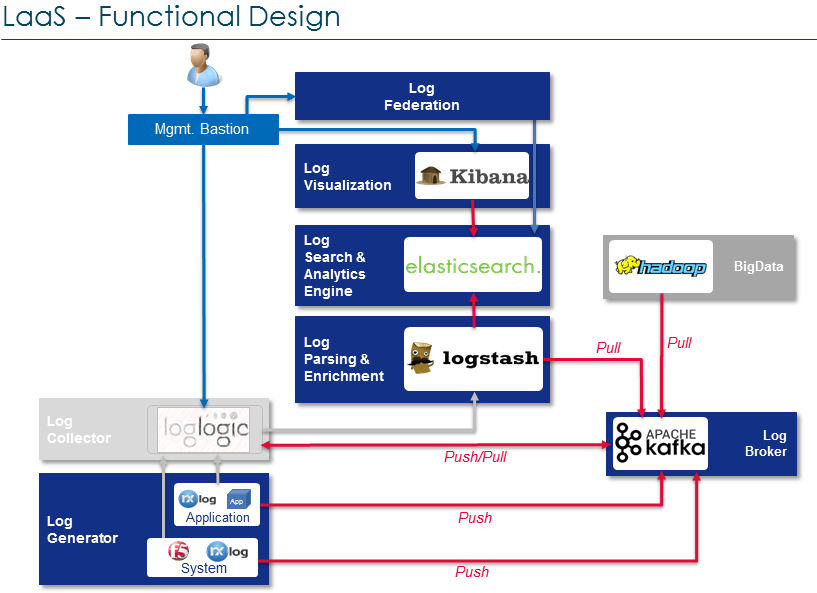
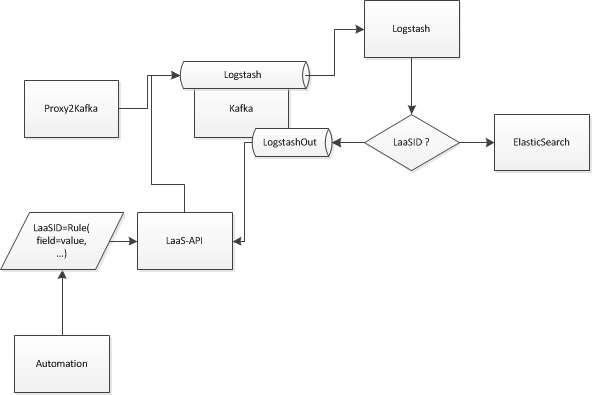
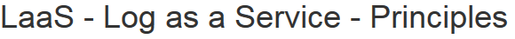
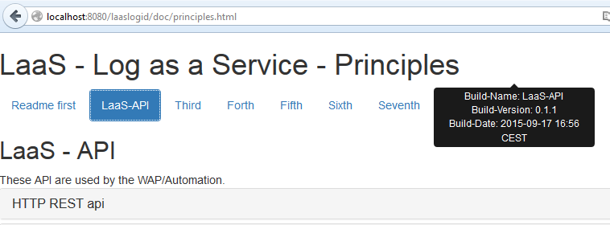

# elk-LaaS-API

Copyright 2015 Pascal TROUVIN <pascal.trouvin at o4s.fr>.

Licensed under the Apache License, Version 2.0 (the "License");
you may not use this file except in compliance with the License.
You may obtain a copy of the License at

     http://www.apache.org/licenses/LICENSE-2.0

Unless required by applicable law or agreed to in writing, software
distributed under the License is distributed on an "AS IS" BASIS,
WITHOUT WARRANTIES OR CONDITIONS OF ANY KIND, either express or implied.
See the License for the specific language governing permissions and
limitations under the License.

<h2>Version - History</h2>
 Build-Version: 0.3.2
 Build-Date: 2015-11-15 20:15 CEST
<ul>
<li>Fix bug in rules (=i ignorecase forgotten)</li>
</ul>

<h2>LaaS - Log as a Service - Principles</h2>

                
<h2>LaaS - API</h2>
                
These API are used by the WAP/Automation.
                
HTTP REST api
<dl>
<dt>Create / Update a logid or an associated field</dt>
<dd>
                                        Make an HTTP PUT request to web service <b>/LaaS-API/logid</b>
                                        with the following parameter in query string:
<ul>
<li>
                                                <b>lid</b> or <b>logid</b> the logid key, as a string
                                                 
                                                Be careful with this key, the value MUST not be easilly guessable for obvious security reasons.
                                                 You must integrate random data.
                                                 A proposal:  cat /dev/urandom | tr -dc 'a-zA-Z0-9' | fold -w 32 | head -n 1
</li>
<li>
                                                rule_name=&lt;RULE&gt;
                                                 With &lt;RULE&gt;:
                                                 <b>fieldName</b><b>Comparator</b><b>fieldValue</b>
                                                 <ul>
                                                    <li><b>=</b> equals</li>
                                                    <li><b>=i</b> equals ignore case</li>
                                                    <li><b>^=</b> starts with</li>
                                                    <li><b>=$</b> ends with</li>
                                                    <li><b>~</b> regular expression</li>
                                                </ul>
</li>
<li>All the rules defined on the same request are logically <b>AND</b></li>
</ul>
<pre>$ unset http_proxy; curl -XPUT "http://127.0.0.1:8080/laaslogid/logid?lid=RANDOMDATA&rule1=host=www.monsite.fr&rule2=uri^=monAppli"
[{"lid":"RANDOMDATA","rule1":["http://www.monsite.fr"],"status":"OK","comment":"CREATED"}]
                                        </pre>
</dd>
<dt>Delete a logid</dt>
<dd>
                                        Make an HTTP DELETE request to web service <b>/LaaS-API/logid</b>
                                        with the following parameter in query string:
                                        <ul>
                                            <li>
                                                <b>lid</b> or <b>logid</b> the logid key, as a string
                                            </li>
                                        </ul>
</dd>
<dt>Get a logid details</dt>
<dd>
                                        Make an HTTP GET request to web service <b>/LaaS-API/logid</b>
                                        with the following parameter in query string:
                                        <ul>
                                            <li>
                                                <b>lid</b> or <b>logid</b> the logid key, as a string
                                            </li>
                                        </ul>
                                        <pre>$ unset http_proxy; curl -XGET "http://127.0.0.1:8080/laaslogid/logid?lid=RANDOMDATA"
[{"lid":"RANDOMDATA","url":["http://www.monsite.fr"]}]
                                        </pre>
</dd>
<dt>Get the number of logids stored</dt>
<dd>
                                        Make an HTTP GET request to web service <b>/LaaS-API/logid</b>
                                        with the following parameter in query string:
                                        <ul>
                                            <li>
                                                <b>action=count</b>
                                            </li>
                                        </ul>
                                        The returned value is sent as JSON.
                                        <pre>$ unset http_proxy; curl "http://127.0.0.1:8080/laaslogid/logid?action=count"   
{"count":1}
                                        </pre>
</dd>
<dt>Get all the logids stored</dt>
<dd>
                                        Make an HTTP GET request to web service <b>/LaaS-API/logid</b>
                                        with the following parameter in query string:
                                        <ul>
                                            <li>
                                                <b>action=getall</b>
                                            </li>
                                        </ul>
                                        <pre>$ unset http_proxy; curl "http://127.0.0.1:8080/laaslogid/logid?action=getall"
[{"lid":"RANDOMDATA","url":["http://www.monsite.fr"]}]
                                        </pre>
</dd>
<dt>Test the rules</dt>
<dd>
                                        Make an HTTP POST request to web service <b>/LaaS-API/logid</b>
                                        with the JSON lines you want to test.
                                         One JSON message par line
</dd>

</dl>

<h2>Add/Get APIKEYS</h2>

<b>cat /usr/share/tomcat/LaaS.apikeys.properties</b>

<pre>
ABCDEFGHIJK010203=Mon API de TEST
MLDMDLMSDL?QLKS?KQ?SK=api test 2
</pre>
                                

Just edit the file to add a new api key, it will be usable from now.

The API will detect the file update and reload them.

                                

Think to synchronize the file with the other nodes.

<h2>LaaS ids?</h2>

LaaSIds are create and maintain by WAP/Automation.

They are stored as JSON file: <b>/usr/share/tomcat/laas-logids.json</b>

<pre>cat /usr/share/tomcat/laas-logid.json
[{"lid":"88","vid":["v88","v89"],"uid":["u88"]},{"lid":"89","vid":["89"],"sid":["89"]},{"lid":"90","vid":["90"],"sid":["90"]},{"lid":"91","vid":["91"],"sid":["91"]},{"lid":"92","vid":["92"],"sid":["92"]},{"lid":"93","vid":["93"],"sid":["93"]},{"lid":"94","vid":["94"],"sid":["94"]},{"lid":"95","vid":["95"],"sid":["95"]},{"lid":"96","vid":["96"],"sid":["96"]},{"lid":"97","v</pre>

<h2>Parameters</h2>

<b>cat /usr/share/tomcat/LaaS.properties</b>

<pre>
no-authentication-for=^(10\\.225\\.138\\.[0-9]+)$
forward-updates-to=http://10.225.138.11/LaaS-API/logid
</pre>
                                
<dl>
<dt>no-authentication-for</dt>
<dd>
                                        A regular expression that define a filter to client IP
                                        address 
                                        (use X-Forwarded-For HTTP header if present,and 
                                        inserted by nginx)
</dd>
<dt>forward-updates-to</dt>
<dd>
                                        Define the URL to send all updates to.
                                         
                                        Think to disable the APIKEY authentication for this host.(parameter no-authentication-for on the remote host)
</dd>
</dl>

<h2>Tests</h2>
<ol>
<li>Login: <pre>$ unset http_proxy; curl -D - -L --user "ABCDEFGHIJK010203:Mon API de TEST" "http://127.0.0.1:8080/laaslogid/login"
HTTP/1.1 200 OK
Server: Apache-Coyote/1.1
Set-Cookie: JSESSIONID=F870D000C9943B34237470519B9918E7; Path=/laaslogid/; HttpOnly
Content-Type: text/html;charset=UTF-8
Content-Length: 167
Date: Wed, 16 Sep 2015 14:40:05 GMT

You are logged with APIkey 'ABCDEFGHIJK010203'
</pre>
</li>
<li>
<pre>$ unset http_proxy; curl -D - --cookie "JSESSIONID=F265A5ADD3E719741E3E73514A9595CA" "http://127.0.0.1:8080/laaslogid/logid?action=count"
HTTP/1.1 200 OK
Server: Apache-Coyote/1.1
Content-Type: application/json;charset=UTF-8
Content-Length: 13
Date: Wed, 16 Sep 2015 14:46:28 GMT

{"count":100}
</pre>
</li>
<li>
logout: <pre>$ unset http_proxy; curl -D - --cookie "JSESSIONID=F265A5ADD3E719741E3E73514A9595CA" "http://127.0.0.1:8080/laaslogid/login?logout"
HTTP/1.1 401 Non-Autorisé
Server: Apache-Coyote/1.1
WWW-Authenticate: Basic "CloudOps-LaaS- API key"
Content-Type: text/html;charset=utf-8
Content-Language: fr
Content-Length: 1369
Date: Wed, 16 Sep 2015 14:47:13 GMT

</pre>
</li>
</ol>

<h2>HowTo</h2>
                
<h3>Get the API component version</h3>
Open the documentation page: 
 Move your mouse on the page title 
                                
 

<h2>Dependencies</h2>

<ul>
<li><a href="https://hc.apache.org/">Apache http client</a></li>
<li><a href="https://github.com/java-native-access/jna">Java Native Access - jna</a></li>
<li><a href="https://github.com/google/gson">Google JSON - gson</a></li>
<li><a href="http://kafka.apache.org/">Apache Message Queue - kafka</a></li>
<li><a href="http://www.slf4j.org/">Simple Logging Facade for Java - slf4j</a></li>
<li><a href="https://pholser.github.io/jopt-simple/">Command-line option parser - jopt-simple</a></li>
<li><a href="https://code.google.com/archive/p/jsnappy/">Google De/Compressor - snappy</a></li>
</ul>

Detailed librairies
<ul>
<li>commons-codec-1.9.jar</li>
<li>commons-logging-1.2.jar</li>
<li>fluent-hc-4.5.1.jar</li>
<li>httpclient-4.5.1.jar</li>
<li>httpclient-cache-4.5.1.jar</li>
<li>httpclient-win-4.5.1.jar</li>
<li>httpcore-4.4.3.jar</li>
<li>httpmime-4.5.1.jar</li>
<li>jna-4.1.0.jar</li>
<li>jna-platform-4.1.0.jar</li>
<li>gson-2.3.1.jar</li>
<li>kafka_2.9.1-0.8.2.1.jar</li>
<li>log4j-1.2.16.jar</li>
<li>lz4-1.2.0.jar</li>
<li>metrics-core-2.2.0.jar</li>
<li>scala-library-2.9.1.jar</li>
<li>slf4j-api-1.7.6.jar</li>
<li>slf4j-log4j12-1.6.1.jar</li>
<li>snappy-java-1.1.1.6.jar</li>
<li>zkclient-0.3.jar</li>
<li>zookeeper-3.4.6.jar</li>
<li>jopt-simple-3.2.jar</li>
<li>kafka-clients-0.8.2.1.jar</li>
</ul>

<h2>Installation</h2>

